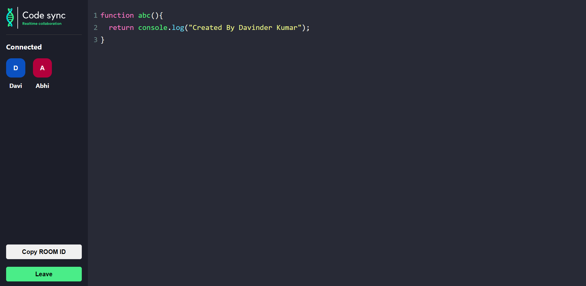

# Booking App

## Description

This project is a React-based user interface to display user profile, accommodation and booking details.

## Usage

To use this project, follow these steps:

1. Clone the repository to your local machine.
2. Install the necessary dependencies using `npm install`.
3. Run the application using `npm start`.
4. Access the application in your browser at `http://localhost:3000`.

## UI

View on different devices

## Author

- [Davinder Kumar](https://github.com/abhi07070)

## License

This project is licensed under the [MIT License](LICENSE). Feel free to use and modify it as needed.
